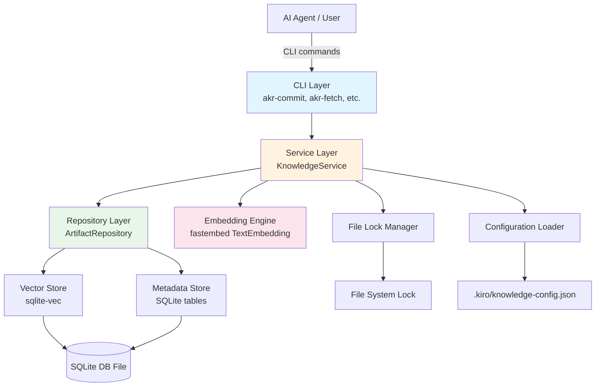
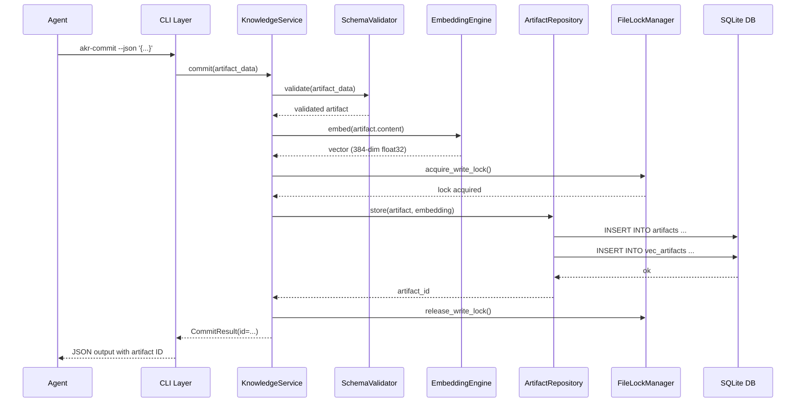

# Design Document: Agent Knowledge Repository

## Overview

The Agent Knowledge Repository (AKR) is a Python CLI tool that enables AI agents to commit, retrieve, update, and manage knowledge artifacts in a local vector-searchable repository. It uses sqlite-vec for embedded vector storage and fastembed for local ONNX-based embedding generation, requiring no external services, GPU hardware, or system-level packages beyond Python 3.9+.

The system is structured as a layered architecture: CLI commands at the top, a service layer for business logic, a repository layer for data access, and infrastructure components (embedding, vector store, locking) at the bottom. Knowledge artifacts are JSON-serialized structured documents stored in SQLite alongside their vector embeddings, enabling both exact-match lookups and semantic similarity search.

Two repository modes are supported: a shared team-wide repository at a configurable system path, and a per-user repository under `.kiro/knowledge/`. Both can be active simultaneously, with fetch results merged and source-annotated.

## Architecture

### High-Level Architecture



### Component Interaction Flow (akr-commit)



### Design Decisions

1. **Single SQLite database file per repository**: Artifacts, metadata, audit trail, and vector index all live in one `.db` file. This simplifies backup, migration, and atomic operations.

2. **fastembed with BAAI/bge-small-en-v1.5 as default model**: This model produces 384-dimensional vectors, is quantized for CPU performance, and is well-suited for general-purpose text retrieval. It's pip-installable with no PyTorch dependency.

3. **File-system locking via `fcntl.flock`**: Available natively on RHEL 9 / Linux. A dedicated `.lock` file adjacent to the database file serializes writes. Reads do not require locks (SQLite WAL mode handles concurrent reads).

4. **SQLite WAL mode**: Enables concurrent reads while writes are serialized, providing good performance for the expected workload (many reads, occasional writes).

5. **Cosine distance for similarity**: sqlite-vec's `vec_distance_cosine` is used for ranking. Lower distance = more similar. A configurable threshold filters out irrelevant results.

## Components and Interfaces

### 1. CLI Layer (`akr/cli.py`)

Entry points for each command, implemented as standalone scripts with the `akr-` prefix. Each command parses arguments, delegates to `KnowledgeService`, and formats output as JSON.

```python
# CLI command signatures

def akr_commit(args: argparse.Namespace) -> int:
    """Store a new knowledge artifact.
    
    Args via CLI:
        --json <payload>     JSON string conforming to KnowledgeSchema
        --file <path>        Path to JSON file (alternative to --json)
        --repo <mode>        Repository mode: 'shared', 'user', or 'auto' (default: from config)
    
    Returns: exit code 0 on success, 1 on error
    Stdout: JSON with {"id": "<uuid>", "status": "committed"}
    """

def akr_fetch(args: argparse.Namespace) -> int:
    """Fetch knowledge artifacts by semantic search.
    
    Args via CLI:
        --query <text>       Natural language query string
        --top-n <int>        Number of results (default: 5, from config)
        --threshold <float>  Minimum similarity threshold (default: from config)
        --repo <mode>        Repository mode: 'shared', 'user', 'both' (default: from config)
    
    Returns: exit code 0 on success, 1 on error
    Stdout: JSON array of {artifact, score, source_repo}
    """

def akr_update(args: argparse.Namespace) -> int:
    """Update an existing knowledge artifact.
    
    Args via CLI:
        --id <uuid>          Artifact identifier
        --json <payload>     Updated JSON payload
        --file <path>        Path to JSON file (alternative to --json)
        --repo <mode>        Repository mode
    
    Returns: exit code 0 on success, 1 on error
    Stdout: JSON with {"id": "<uuid>", "status": "updated"}
    """

def akr_delete(args: argparse.Namespace) -> int:
    """Delete a knowledge artifact.
    
    Args via CLI:
        --id <uuid>          Artifact identifier
        --repo <mode>        Repository mode
    
    Returns: exit code 0 on success, 1 on error
    Stdout: JSON with {"id": "<uuid>", "status": "deleted"}
    """

def akr_list(args: argparse.Namespace) -> int:
    """List knowledge artifacts with optional filters.
    
    Args via CLI:
        --tags <tag1,tag2>   Filter by tags (AND logic)
        --since <date>       Filter by modification date (ISO 8601)
        --limit <int>        Max results (default: 20)
        --offset <int>       Pagination offset (default: 0)
        --repo <mode>        Repository mode
    
    Returns: exit code 0 on success, 1 on error
    Stdout: JSON array of artifact summaries
    """
```

### 2. Service Layer (`akr/service.py`)

Orchestrates business logic: validation, embedding generation, repository operations, and locking.

```python
class KnowledgeService:
    def __init__(self, config: AKRConfig):
        self.config = config
        self.validator = SchemaValidator()
        self.embedding_engine = EmbeddingEngine(config.embedding_model)
        self.repositories: dict[str, ArtifactRepository] = {}
        self.lock_manager = FileLockManager()
    
    def commit(self, artifact_data: dict, repo_mode: str | None = None) -> CommitResult:
        """Validate, embed, and store a new artifact."""
    
    def fetch(self, query: str, top_n: int, threshold: float, repo_mode: str | None = None) -> list[FetchResult]:
        """Semantic search across configured repositories."""
    
    def update(self, artifact_id: str, artifact_data: dict, repo_mode: str | None = None) -> UpdateResult:
        """Update artifact content and re-embed."""
    
    def delete(self, artifact_id: str, repo_mode: str | None = None) -> DeleteResult:
        """Remove artifact and its embedding."""
    
    def list_artifacts(self, tags: list[str] | None, since: str | None, limit: int, offset: int, repo_mode: str | None = None) -> ListResult:
        """List artifacts with optional filters."""
```

### 3. Repository Layer (`akr/repository.py`)

Direct database operations against a single SQLite database.

```python
class ArtifactRepository:
    def __init__(self, db_path: str):
        """Open or create the SQLite database with sqlite-vec loaded."""
    
    def initialize_schema(self) -> None:
        """Create tables and vec0 virtual table if not present."""
    
    def insert_artifact(self, artifact: KnowledgeArtifact, embedding: bytes) -> str:
        """Insert artifact row and vector embedding. Returns artifact ID."""
    
    def get_artifact(self, artifact_id: str) -> KnowledgeArtifact | None:
        """Retrieve a single artifact by ID."""
    
    def update_artifact(self, artifact_id: str, artifact: KnowledgeArtifact, embedding: bytes) -> bool:
        """Replace artifact content and vector. Returns True if found."""
    
    def delete_artifact(self, artifact_id: str) -> bool:
        """Remove artifact and vector. Returns True if found."""
    
    def search_by_vector(self, query_embedding: bytes, top_n: int, threshold: float) -> list[tuple[str, float]]:
        """KNN search using vec0 virtual table. Returns (artifact_id, distance) pairs."""
    
    def list_artifacts(self, tags: list[str] | None, since: str | None, limit: int, offset: int) -> list[KnowledgeArtifact]:
        """List artifacts with optional tag/date filters and pagination."""
    
    def insert_audit_record(self, artifact_id: str, previous_content: dict) -> None:
        """Record previous version in audit trail."""
```

### 4. Embedding Engine (`akr/embedding.py`)

Wraps fastembed for vector generation.

```python
class EmbeddingEngine:
    def __init__(self, model_name: str = "BAAI/bge-small-en-v1.5"):
        """Initialize the fastembed TextEmbedding model.
        
        Raises EmbeddingModelError if model cannot be loaded.
        """
    
    def embed(self, text: str) -> bytes:
        """Generate embedding for text, returned as sqlite-vec compatible bytes.
        
        Internally calls fastembed, converts numpy array to float32 bytes
        via struct.pack for sqlite-vec's serialize_float32 format.
        """
    
    def embed_batch(self, texts: list[str]) -> list[bytes]:
        """Batch embedding for multiple texts."""
    
    @property
    def dimensions(self) -> int:
        """Return the embedding dimension count (e.g., 384)."""
```

### 5. Schema Validator (`akr/schema.py`)

Validates artifact payloads against the Knowledge Schema.

```python
class SchemaValidator:
    def validate(self, data: dict) -> KnowledgeArtifact:
        """Validate and return a KnowledgeArtifact.
        
        Raises ValidationError with descriptive message if invalid.
        Required fields: title, content, tags, source_context.
        Auto-populated: id, created_at, updated_at.
        Optional: metadata (arbitrary key-value pairs).
        """
```

### 6. Configuration Loader (`akr/config.py`)

Reads and validates configuration from JSON file.

```python
@dataclass
class AKRConfig:
    repo_mode: str              # 'shared', 'user', or 'both'
    shared_repo_path: str       # default: '/var/lib/agent-knowledge-repo/'
    user_repo_path: str         # default: '~/.kiro/knowledge/'
    embedding_model: str        # default: 'BAAI/bge-small-en-v1.5'
    default_top_n: int          # default: 5
    similarity_threshold: float # default: 0.3 (cosine distance; lower = more similar)

def load_config() -> AKRConfig:
    """Load config from .kiro/knowledge-config.json.
    
    Search order: project root, then home directory.
    Falls back to defaults (user mode) if no config found.
    Raises ConfigValidationError for invalid values.
    """
```

### 7. File Lock Manager (`akr/locking.py`)

Serializes writes using file-system locks.

```python
class FileLockManager:
    def acquire_write_lock(self, db_path: str, timeout: float = 10.0) -> FileLock:
        """Acquire exclusive lock on <db_path>.lock file using fcntl.flock.
        
        Raises LockTimeoutError if lock cannot be acquired within timeout.
        Returns a context-manager-compatible FileLock object.
        """
```

### 8. Serialization (`akr/serialization.py`)

JSON serialization/deserialization with round-trip guarantee.

```python
def serialize_artifact(artifact: KnowledgeArtifact) -> str:
    """Serialize artifact to JSON string."""

def deserialize_artifact(json_str: str) -> KnowledgeArtifact:
    """Deserialize JSON string to KnowledgeArtifact."""

def pretty_print_artifact(artifact: KnowledgeArtifact) -> str:
    """Format artifact as human-readable JSON with 2-space indentation."""
```


## Data Models

### Knowledge Artifact

```python
@dataclass
class KnowledgeArtifact:
    id: str                          # UUID v4, auto-generated on commit
    title: str                       # Required, non-empty
    content: str                     # Required, non-empty, primary text for embedding
    tags: list[str]                  # Required, at least one tag
    source_context: str              # Required, e.g. file path, function name, interaction ID
    created_at: str                  # ISO 8601 timestamp, auto-populated
    updated_at: str                  # ISO 8601 timestamp, auto-populated
    metadata: dict[str, str] | None  # Optional arbitrary key-value pairs
```

### JSON Schema for Knowledge Artifact

```json
{
  "type": "object",
  "required": ["title", "content", "tags", "source_context"],
  "properties": {
    "title": { "type": "string", "minLength": 1 },
    "content": { "type": "string", "minLength": 1 },
    "tags": {
      "type": "array",
      "items": { "type": "string" },
      "minItems": 1
    },
    "source_context": { "type": "string", "minLength": 1 },
    "metadata": {
      "type": "object",
      "additionalProperties": { "type": "string" }
    }
  }
}
```

Note: `id`, `created_at`, and `updated_at` are not part of the input schema — they are auto-generated by the CLI tool.

### SQLite Database Schema

```sql
-- Enable WAL mode for concurrent read access
PRAGMA journal_mode=WAL;

-- Main artifacts table
CREATE TABLE IF NOT EXISTS artifacts (
    id TEXT PRIMARY KEY,                    -- UUID v4
    title TEXT NOT NULL,
    content TEXT NOT NULL,
    tags TEXT NOT NULL,                     -- JSON array of strings
    source_context TEXT NOT NULL,
    metadata TEXT,                          -- JSON object, nullable
    created_at TEXT NOT NULL,               -- ISO 8601
    updated_at TEXT NOT NULL                -- ISO 8601
);

-- Index for tag-based filtering (using JSON functions)
CREATE INDEX IF NOT EXISTS idx_artifacts_updated_at ON artifacts(updated_at DESC);

-- Vector table for embeddings (sqlite-vec virtual table)
-- 384 dimensions matches BAAI/bge-small-en-v1.5 output
CREATE VIRTUAL TABLE IF NOT EXISTS vec_artifacts USING vec0(
    artifact_id TEXT PRIMARY KEY,
    embedding float[384]
);

-- Audit trail for update history
CREATE TABLE IF NOT EXISTS audit_trail (
    id INTEGER PRIMARY KEY AUTOINCREMENT,
    artifact_id TEXT NOT NULL,
    previous_content TEXT NOT NULL,         -- Full JSON of previous artifact state
    changed_at TEXT NOT NULL,               -- ISO 8601 timestamp
    FOREIGN KEY (artifact_id) REFERENCES artifacts(id) ON DELETE CASCADE
);
```

### Key SQL Operations

**Commit (insert artifact + embedding):**
```sql
INSERT INTO artifacts (id, title, content, tags, source_context, metadata, created_at, updated_at)
VALUES (?, ?, ?, ?, ?, ?, ?, ?);

INSERT INTO vec_artifacts (artifact_id, embedding)
VALUES (?, ?);
```

**Fetch (KNN semantic search):**
```sql
SELECT
    a.id, a.title, a.content, a.tags, a.source_context,
    a.metadata, a.created_at, a.updated_at,
    v.distance
FROM vec_artifacts v
INNER JOIN artifacts a ON a.id = v.artifact_id
WHERE v.embedding MATCH ?
    AND v.distance < ?
ORDER BY v.distance
LIMIT ?;
```

The `?` parameters are: query embedding (as float32 bytes), similarity threshold, and top-N limit.

**List with tag filter:**
```sql
SELECT id, title, tags, source_context, updated_at
FROM artifacts
WHERE (? IS NULL OR (
    SELECT COUNT(*) FROM json_each(tags)
    WHERE json_each.value IN (SELECT value FROM json_each(?))
) = json_array_length(?))
AND (? IS NULL OR updated_at >= ?)
ORDER BY updated_at DESC
LIMIT ? OFFSET ?;
```

**Update (with audit trail):**
```sql
-- Record previous state
INSERT INTO audit_trail (artifact_id, previous_content, changed_at)
SELECT id, json_object(
    'title', title, 'content', content, 'tags', tags,
    'source_context', source_context, 'metadata', metadata,
    'created_at', created_at, 'updated_at', updated_at
), ? FROM artifacts WHERE id = ?;

-- Update artifact
UPDATE artifacts SET title=?, content=?, tags=?, source_context=?, metadata=?, updated_at=?
WHERE id=?;

-- Update embedding
DELETE FROM vec_artifacts WHERE artifact_id = ?;
INSERT INTO vec_artifacts (artifact_id, embedding) VALUES (?, ?);
```

### Configuration File Format

`.kiro/knowledge-config.json`:
```json
{
  "repo_mode": "user",
  "shared_repo_path": "/var/lib/agent-knowledge-repo/",
  "embedding_model": "BAAI/bge-small-en-v1.5",
  "default_top_n": 5,
  "similarity_threshold": 0.3
}
```

### Steering File

`.kiro/steering/agent-knowledge.md`:
```markdown
---
inclusion: auto
---

# Agent Knowledge Repository Integration

## When to Fetch Knowledge
- At the start of each interaction, run `akr-fetch --query "<brief description of the task>"` to retrieve relevant prior knowledge.
- Before making architectural decisions, fetch related knowledge with appropriate query terms.

## When to Commit Knowledge
- After discovering a significant bug fix pattern, run `akr-commit` with the learning.
- After making an architectural decision, commit the rationale and context.
- After identifying a useful code pattern or dependency insight, commit it.
- Always include relevant tags: "architecture", "bug-fix", "pattern", "dependency", "configuration", etc.
- Always include source context: file paths, function names, or interaction identifiers.

## When to Update Knowledge
- When new information supersedes prior knowledge, use `akr-update` instead of creating a duplicate.
- Before committing, run `akr-fetch` to check for existing similar knowledge.

## Command Reference
- `akr-fetch --query "..." [--top-n N] [--threshold T]`
- `akr-commit --json '{"title": "...", "content": "...", "tags": [...], "source_context": "..."}'`
- `akr-update --id <uuid> --json '{"title": "...", "content": "...", "tags": [...], "source_context": "..."}'`
- `akr-delete --id <uuid>`
- `akr-list [--tags tag1,tag2] [--since YYYY-MM-DD] [--limit N]`
```

### File System Layout

```
/var/lib/agent-knowledge-repo/          # Shared repository (configurable)
├── knowledge.db                        # SQLite database (artifacts + vec_artifacts + audit_trail)
└── knowledge.db.lock                   # File-system write lock

~/.kiro/
├── knowledge/                          # User repository
│   ├── knowledge.db
│   └── knowledge.db.lock
├── knowledge-config.json               # Configuration file
└── steering/
    └── agent-knowledge.md              # Steering file (inclusion: auto)
```

### Package Structure

```
akr/
├── __init__.py
├── cli.py              # CLI entry points and argument parsing
├── service.py          # KnowledgeService business logic
├── repository.py       # ArtifactRepository database operations
├── embedding.py        # EmbeddingEngine (fastembed wrapper)
├── schema.py           # SchemaValidator and KnowledgeArtifact dataclass
├── serialization.py    # JSON serialize/deserialize/pretty-print
├── config.py           # AKRConfig and load_config()
├── locking.py          # FileLockManager (fcntl.flock)
└── errors.py           # Custom exception hierarchy
```

### pip Dependencies

| Package | Purpose | Notes |
|---------|---------|-------|
| `sqlite-vec` | Vector search SQLite extension | Zero-dependency C extension, pip-installable |
| `fastembed` | ONNX embedding generation | CPU-only, no PyTorch/TensorFlow dependency |

All other functionality uses the Python 3.9+ standard library (`sqlite3`, `json`, `argparse`, `uuid`, `fcntl`, `struct`, `dataclasses`, `datetime`, `pathlib`).


## Correctness Properties

*A property is a characteristic or behavior that should hold true across all valid executions of a system — essentially, a formal statement about what the system should do. Properties serve as the bridge between human-readable specifications and machine-verifiable correctness guarantees.*

### Property 1: Commit round-trip preserves artifact data

*For any* valid KnowledgeArtifact payload (with random title, content, tags, source_context, and optional metadata), committing it to the repository and then retrieving it by the returned ID should produce an artifact with identical title, content, tags, source_context, and metadata fields. Additionally, the retrieved artifact should have non-empty `created_at` and `updated_at` timestamps in ISO 8601 format, and a corresponding embedding row should exist in the vector store.

**Validates: Requirements 1.1, 5.2, 5.3, 6.2**

### Property 2: Invalid payloads are rejected by schema validation

*For any* dict that violates the Knowledge Schema (missing required fields like title, content, tags, or source_context; or containing empty strings for required fields; or tags being an empty list), the schema validator should raise a ValidationError and the repository should remain unchanged.

**Validates: Requirements 1.2, 3.3, 5.1, 5.4**

### Property 3: Committed artifact IDs are unique

*For any* sequence of N valid KnowledgeArtifact payloads committed to the same repository, all N returned artifact IDs should be distinct non-empty strings.

**Validates: Requirements 1.3**

### Property 4: Fetch results are ordered by distance and bounded by top-N

*For any* repository containing committed artifacts and any natural-language query string, the fetch results should satisfy: (a) the number of results is at most top_n, (b) each result includes a numeric distance score, and (c) the results are ordered by ascending distance (most similar first).

**Validates: Requirements 2.1, 2.4, 6.3**

### Property 5: Update replaces artifact content and regenerates embedding

*For any* committed artifact and any new valid payload, updating the artifact should cause a subsequent retrieval by ID to return the new content (not the original), and the embedding in the vector store should differ from the original embedding.

**Validates: Requirements 3.1**

### Property 6: Update records previous version in audit trail

*For any* committed artifact that is subsequently updated, the audit trail should contain a record with the artifact's ID, the previous content matching the original artifact, and a valid timestamp.

**Validates: Requirements 3.4**

### Property 7: Delete removes artifact and embedding

*For any* committed artifact, deleting it by ID should cause subsequent retrieval by ID to return None, the vec_artifacts table to contain no row for that ID, and the delete operation should return a confirmation that includes the artifact's ID.

**Validates: Requirements 4.1, 4.3**

### Property 8: Dual-repo fetch annotates source repository

*For any* fetch performed in "both" repository mode where artifacts exist in both the shared and user repositories, every result in the returned list should include a `source_repo` field with a value of either "shared" or "user".

**Validates: Requirements 8.4**

### Property 9: Configuration validation rejects invalid values

*For any* configuration dict containing an invalid value (negative `default_top_n`, `similarity_threshold` outside [0, 2], unknown `repo_mode` string), loading the configuration should raise a ConfigValidationError identifying the specific invalid field.

**Validates: Requirements 9.4**

### Property 10: List returns results sorted by updated_at descending, bounded by limit

*For any* set of committed artifacts and any positive limit value, the list operation should return at most `limit` results, and the results should be sorted by `updated_at` in descending order (most recently modified first).

**Validates: Requirements 12.1, 12.4**

### Property 11: List tag filter returns only artifacts matching all specified tags

*For any* set of committed artifacts with various tag combinations and any subset of tags used as a filter, every artifact in the filtered list result should contain all of the specified filter tags.

**Validates: Requirements 12.2**

### Property 12: List date filter returns only artifacts modified on or after the specified date

*For any* set of committed artifacts and any ISO 8601 date string used as a `--since` filter, every artifact in the filtered list result should have an `updated_at` timestamp greater than or equal to the filter date.

**Validates: Requirements 12.3**

### Property 13: Serialization round-trip

*For any* valid KnowledgeArtifact object, serializing it to JSON and then deserializing the JSON back should produce an object with identical field values.

**Validates: Requirements 13.4**

### Property 14: Pretty-print produces valid JSON

*For any* valid KnowledgeArtifact object, the pretty-print function should produce a string that is valid JSON, contains newline characters (indicating indentation/formatting), and when parsed back yields the same field values as the original artifact.

**Validates: Requirements 13.3**

## Error Handling

### Exception Hierarchy

```python
class AKRError(Exception):
    """Base exception for all AKR errors."""

class ValidationError(AKRError):
    """Raised when artifact payload fails schema validation.
    Contains field-level error details."""

class ArtifactNotFoundError(AKRError):
    """Raised when an artifact ID does not exist in the repository."""

class EmbeddingModelError(AKRError):
    """Raised when the ONNX embedding model cannot be loaded.
    Message includes model name and suggested pip install command."""

class RepositoryError(AKRError):
    """Raised when database operations fail (connection, write, read)."""

class LockTimeoutError(AKRError):
    """Raised when file lock cannot be acquired within timeout."""

class ConfigValidationError(AKRError):
    """Raised when configuration file contains invalid values.
    Contains field-level error details."""
```

### Error Handling Strategy

| Scenario | Behavior | Exit Code |
|----------|----------|-----------|
| Invalid payload (commit/update) | Return JSON `{"error": "validation_error", "details": [...]}` | 1 |
| Artifact not found (update/delete) | Return JSON `{"error": "not_found", "id": "..."}` | 1 |
| Embedding model unavailable | Return JSON `{"error": "model_error", "model": "...", "suggestion": "pip install ..."}` | 1 |
| Database write failure | Return JSON `{"error": "repository_error", "reason": "..."}` | 1 |
| Lock timeout | Return JSON `{"error": "lock_timeout", "path": "..."}` | 1 |
| Invalid config | Return JSON `{"error": "config_error", "fields": [...]}` | 1 |
| No fetch results | Return JSON `{"results": [], "message": "No relevant knowledge found"}` | 0 |
| Success | Return JSON with operation result | 0 |

All errors are caught at the CLI layer and formatted as JSON to stdout. The CLI never raises unhandled exceptions — all `AKRError` subclasses are caught and formatted. Unexpected exceptions are caught with a generic error message and exit code 2.

## Testing Strategy

### Dual Testing Approach

The testing strategy combines property-based tests for universal correctness guarantees with example-based unit tests for specific scenarios and edge cases.

### Property-Based Tests

Library: [Hypothesis](https://hypothesis.readthedocs.io/) (pip-installable, Python's standard PBT library)

Each correctness property from the design document maps to a single Hypothesis test with a minimum of 100 iterations. Tests use `@given` decorators with custom strategies for generating random KnowledgeArtifact payloads, query strings, tag sets, and configuration values.

**Custom Strategies:**
- `valid_artifact()` — generates random KnowledgeArtifact dicts with valid title, content, tags, source_context, and optional metadata
- `invalid_artifact()` — generates dicts that violate the schema in various ways (missing fields, empty strings, wrong types)
- `query_text()` — generates random natural-language query strings
- `tag_set()` — generates random lists of tag strings
- `config_values()` — generates both valid and invalid configuration dicts

**Test Configuration:**
- Minimum 100 examples per property (`@settings(max_examples=100)`)
- Each test tagged with: `# Feature: agent-knowledge-repository, Property N: <property_text>`
- Tests use an in-memory SQLite database (`:memory:`) for isolation and speed
- fastembed model is initialized once per test session (session-scoped fixture)

### Unit Tests (Example-Based)

Framework: pytest (pip-installable)

Unit tests cover:
- Specific error scenarios (1.4: unreachable repository, 3.2: update non-existent ID, 4.2: delete non-existent ID, 6.5: unavailable model)
- Edge cases (2.2: no matching results, empty repository operations)
- Configuration defaults (7.4: default shared path, 9.3: missing config file defaults)
- Repository mode isolation (8.1, 8.2: user mode path, 8.3: both mode merge)
- Steering file structure (10.5: inclusion: auto directive)

### Integration Tests

- Concurrent write safety (7.2, 7.3): Multi-threaded commits to shared repository, verify no data corruption
- Performance benchmark (2.3): Load 10,000 artifacts, verify fetch < 2 seconds
- End-to-end CLI tests: Invoke `akr-commit`, `akr-fetch`, `akr-update`, `akr-delete`, `akr-list` as subprocesses, verify JSON output

### Test Dependencies

| Package | Purpose |
|---------|---------|
| `pytest` | Test framework |
| `hypothesis` | Property-based testing |

